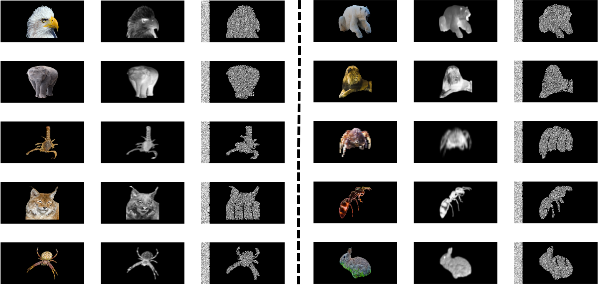

## Discovering autostereograms with Convolutional Neural Networks


Source image (left), fake depth map (center), sillouhute discovered by our model (right).

## Install

This code have been tested with GPU GTX 1080Ti and CPU over Ubuntu 18.

Install the repository:

```
git clone https://github.com/dasolma/autostereograms-discoverer
```

Create and activate the environment (conda is recommended):

```
conda create --name autostereograms
conda activate autostereograms
```

Install the requirements:

```
pip install -r requirements.txt
```


## Acknowledgements
This research is partially supported by The Spanish Ministry of Economy and Competitiveness through the project VICTORY (grant no.: TIN2017-82113-C2-1-R).
